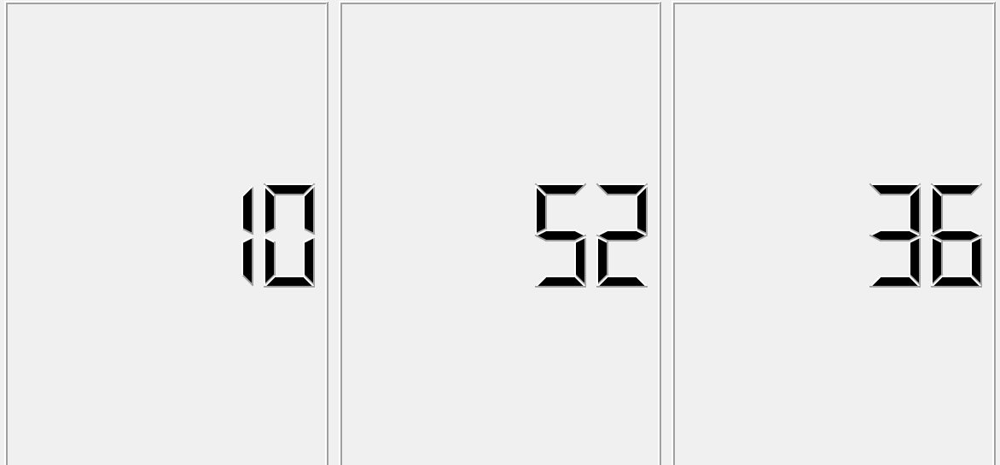

# <span style="color:lightseagreen">**Introduction**</span>
**GUI** graphical user interface is a form of user interface that allows users to interact with electronic devices through graphical icons. Designing the visual composition and temporal behavior of GUI is an important part of software application programming in the area of human-computer interaction. To make the connection between the widgets and users we use some mechanisms by Qt for communication between objects called Signals and slots.
<span style="color:DeepPink">**What are? and what they do?**</span>

# <span style="color:goldenrod">**Signals and Slots**</span>

Signals and slots are used for communication between objects. they are a mechanism that is a central feature of Qt and probably the part that differs most from the features provided by other frameworks.
* <span style="color:goldenrod">**A Signal**</span> is emitted when a particular event occurs.
* <span style="color:goldenrod">**A Slot**</span> a function that is called in response to a particular signal


# <span style="color:lightblue">**Calculator**</span>

This exercise follows up to add interactive functionality to the calculator widgets written in the previous homework. The goal is to use Signals and Slots to simulate a basic calculator behavior. The supported operations are ***, +, -, /**.

We will create a class called calculator that include the following classes :

* <span style="color:DeepPink">**QMainWindow**</span> that provides a main application window
* <span style="color:DeepPink">**QGridLayout**</span> that lays out widgets in a grid
* <span style="color:DeepPink">**QVector**</span> is a template class that provides a dynamic array
* <span style="color:DeepPink">**QPushButton**</span>  widget provides a command button
* <span style="color:DeepPink">**QLCDNumber**</span>  widget displays a number with LCD-like digits
---
## <span style="color:GreenYellow">**calculator.h**:</span>
---
---
 To create the elements that we will use :
```c++

#include <QMainWindow>
#include <QGridLayout>
#include <QVector>
#include <QPushButton>
#include <QLCDNumber>

class Calculator : public QWidget
{
    Q_OBJECT
public:
    Calculator(QWidget *parent = nullptr);
    ~Calculator();

 // Add you custom slots here
protected:
    void createWidgets();        //Function to create the widgets
    void placeWidget();         // Function to place the widgets
    void makeConnexions();
   // Create all the connectivity
    void keyPressEvent(QKeyEvent *e)override;


private:
    QGridLayout *buttonsLayout;
    QVBoxLayout *layout;
    QVector<QPushButton*> digits;

    QPushButton *enter;
    QPushButton *clear;
    QVector<QPushButton*> operations;
    QLCDNumber *disp;

   int * left;
    int * right;
    QString *operation;


public slots:
  void newDigit();
  void changeOperation();
  void op();//for the differents operations 
 void clearHistory();//to clear the screen 

};
```
---
## <span style="color:GreenYellow">**calculator.cpp**:</span>
---
---

The implementation of the methods :
```c++
#include "calculator.h"
#include <QKeyEvent>
#include <QApplication>
#include "math.h"

Calculator::Calculator(QWidget *parent)
    : QWidget(parent)
{
    createWidgets();
    placeWidget();
    makeConnexions();
    op();
    clearHistory();


left=nullptr;
right=nullptr;
operation=nullptr;

}
//this method is for clearing the screen and displaying the 0
void Calculator::clearHistory(){
         disp->display(0);
          delete left;
         left = nullptr;
         delete right;
          right = nullptr;
       delete operation;
        operation = nullptr;

}
//the deconstructor 
Calculator::~Calculator()
{

       // delete disp;
        delete layout;
        delete buttonsLayout;
        delete enter;
        delete disp;
        delete left;
        delete right;
        delete operation;
    delete clear;


    }


//this method is for the creating of the widgets used
void Calculator::createWidgets()
{
    //Creating the layouts
    layout = new QVBoxLayout();
  //->->  layoutH= new QHBoxLayout();
    layout->setSpacing(5);


    //grid layout
    buttonsLayout = new QGridLayout;

   //->-> clear= new QPushButton("clear");

    //creating the buttons
    for(int i=0; i < 10; i++)
    {
        digits.push_back(new QPushButton(QString::number(i)));
        digits.back()->setSizePolicy(QSizePolicy::Expanding, QSizePolicy::Fixed);
        digits.back()->resize(sizeHint().width(), sizeHint().height());
    }
    //enter button
    enter = new QPushButton("Enter",this);
    clear= new QPushButton("clear",this);
    //enter->setSizePolicy(QSizePolicy::Expanding, QSizePolicy::Fixed);
    enter->resize(sizeHint().width(), sizeHint().height());


    //operatiosn buttons
    operations.push_back(new QPushButton("+"));
    operations.push_back(new QPushButton("-"));
    operations.push_back(new QPushButton("*"));
    operations.push_back(new QPushButton("/"));


    //creating the lcd
    disp = new QLCDNumber(this);
    disp->setDigitCount(6);


}
//this method stand for adding the widgets to the layout 
void Calculator::placeWidget()
{

    layout->addWidget(disp);
   // layout1->addWidget(clear);
    layout->addLayout(buttonsLayout);
   //layout->addLayout(layout1);


    //adding the buttons
    for(int i=1; i <10; i++)
        buttonsLayout->addWidget(digits[i], (i-1)/3, (i-1)%3);


    //Adding the operations
    for(int i=0; i < 4; i++)
        buttonsLayout->addWidget(operations[ i], i, 4);


    //Adding the 0 button
    buttonsLayout->addWidget(digits[0], 3, 0);
    buttonsLayout->addWidget(enter, 3, 1, 1,1);
    buttonsLayout->addWidget(clear, 3, 2, 1,1);


    setLayout(layout);
}

//this implementation for adding the first number to the second one 
void Calculator::newDigit( )
{
    //getting the sender
    auto button = dynamic_cast<QPushButton*>(sender());

    //getting the value
    auto value = button->text().toInt();

    //Check if we have an operation defined
    if(operation)
    {
        //check if we have a value or not
        if(!right)
            right = new int{value};
        else
            *right = 10 * (*right) + value;

        disp->display(*right);

    }
    else
    {
        if(!left)
            left = new int{value};
        else
            *left = 10 * (*left) + value;

        disp->display(*left);
    }
}
//addition//

void Calculator::makeConnexions()
{
    //connecting the digits to buttons
    for(int i=0; i <10; i++)
         connect(digits[i], &QPushButton::clicked,
                 this, &Calculator::newDigit);
    //connecting the buttons of the operations with their fonctionnalities
    for(int i=0; i < 4; i++)
        connect(operations[i], &QPushButton::clicked,
                this, &Calculator::changeOperation);
//connect the enter button with the result of the operations 
connect(enter,&QPushButton::clicked,this, &Calculator:: op );
//connect the clear button with his functionality that provide clearing the screen 
connect(clear,&QPushButton::clicked,this,&Calculator::clearHistory);
}
//this method is add the first number to the second one and implement the operation 
void Calculator::op(){

   if( operation==operations[0]->text()){
       disp->display(*left + (*right));

   }
   else if( operation== operations[1]->text()){
       disp->display(*left - *right);
   }
   else if( operation== operations[2]->text()){
       disp->display((*left) * (*right));
   }
   else if( operation== operations[3]->text()){
       disp->display(*left / *right);
 }}


void Calculator::changeOperation()
{
    //Getting the sender button
    auto button = dynamic_cast<QPushButton*>(sender());

    //Storing the operation
    operation = new QString{button->text()};

    //Initiating the right button
    right = new int{0};

    //reseting the display
    disp->display(0);
}

void Calculator::keyPressEvent(QKeyEvent *e)
{
    //Exiting the application by a click on space
    if( e->key() == Qt::Key_Escape)
        qApp->exit(0);
   // if( e->key() == Qt::Key_0)


    //You could add more keyboard interation here (like digit to button)
}
```
---
## <span style="color:GreenYellow">**Main class**</span>
---
create the calculator and see the result by show():

```c++
#include "calculator.h"

#include <QApplication>

int main(int argc, char *argv[])
{
    QApplication a(argc, argv);
    Calculator w;
    //title of the window 
    w.setWindowTitle("Calculator");
    //the size of the window 
    w.resize(500,500);
    //show the result 
    w.show();
    return a.exec();
}

```
> ## <span style="color:orange">**Result**</span>

 


---

# <span style="color:lightblue">**Traffic Light**</span>
In This test we will been able to simulate an interactive  traffic light by using the <span style="color:orange">**QTimer**</span> class and <span style="color:orange">**Radio Buttons**</span>, in the following you can see the interface of traffic light and **Our Goal** is play with lights (<span style="color:red">**red**</span> , <span style="color:yellow">**yellow**</span> , <span style="color:green">**green**</span>):
<pr>

 

 1. Our first test is to change each light 3 seconds in the following order:
```
Red -> Green -> Yellow
```

We will create a class called **TrafficLight** that include the following classes:
* <span style="color:DeepPink">**QWidgets**</span> that provide the set of UI elements used to create the interface 
* <span style="color:DeepPink">**QTime**</span> that provides clock time functions 
* <span style="color:DeepPink">**QTimerEvent**</span> contains parameters that describe a timer event (a scent of regular intervals to identify that have started one or more timers)
* <span style="color:DeepPink">**QKeyEvent**</span>  describe the key event (a scent of widgets with keyboard focus when key are pressed or released)
* Class <span style="color:DeepPink">**QRadioButton:**</span> which provide the radio button display, and we will used especially because it can switched on **(checked)** or off **(unchecked)** that make easier the traffic lights 
---
## <span style="color:Violet">**Trafficlight.h**:</span>
---
---
 To create the elements that we will use :
```c++
#include <QWidget>
#include<QTimerEvent>
#include<QTime>
#include<QKeyEvent>
class QRadioButton;

class TrafficLight: public QWidget{
  Q_OBJECT

public:

  TrafficLight(QWidget * parent = nullptr);

protected:
     void createWidgets();
     void placeWidgets();
//override the virtual function of timerEvent that allows us to use it from the parent class 
     void timerEvent(QTimerEvent *e) override;
//override the virtual function keyPressEvent of that allows us to use it from the parent class 
     void keyPressEvent(QKeyEvent *e) override;


private:
//create to the lights as a radio button 
  QRadioButton * redlight;
  QRadioButton * yellowlight;
  QRadioButton * greenlight;
  int currentTime;

};
```
---
## <span style="color:Violet">**TrafficLight.cpp :**</span>
---
---

The implementation of the methods :

```c++
TrafficLight::TrafficLight(QWidget * parent): QWidget(parent){

    //Creatign the widgets
    createWidgets();

    //place Widgets
    placeWidgets();

}
void TrafficLight::keyPressEvent(QKeyEvent *e){
//press the key_escape button to exit from the interface     
if(e->key() == Qt::Key_Escape)
        qApp->exit();
}
void TrafficLight::createWidgets()
{
  redlight = new QRadioButton;
  //to check if the light is enabling or not and this function is false by default 
  redlight->setEnabled(false);
  // toggle() is to active the light 
  redlight->toggle();
  //create the background of the red light with a red background 
  redlight->setStyleSheet("QRadioButton::indicator:checked { background-color: red;}");

  yellowlight = new QRadioButton;
  yellowlight->setEnabled(false);
  yellowlight->setStyleSheet("QRadioButton::indicator:checked { background-color: yellow;}");

  greenlight = new QRadioButton;
  greenlight->setEnabled(false);
  greenlight->setStyleSheet("QRadioButton::indicator:checked { background-color: green;}");
 //starting the timer with an interval in milliseconds 
 startTimer(2000);
 //initiate the currentTime with 0
 currentTime=0;
 
}

void TrafficLight::timerEvent(QTimerEvent *e){
    currentTime++;
    //if the red-light is on(checked) and pass his 3 second    
    active the greenlight and initiate the currenttime 0
    if(redlight->isChecked() && currentTime== 3){
        greenlight->toggle();
        currentTime=0;
    }
    //if the green-light is on(checked) and pass his 3 second    
    active the yellowlight and initiate the currenttime 0
    if(greenlight->isChecked() && currentTime== 3){
        yellowlight->toggle();
        currentTime=0;
    }
    //if the yellow-light is on(checked) and pass his 3 second    
    active the redlight and initiate the currenttime 0
    if(yellowlight->isChecked() && currentTime== 3){
        redlight->toggle();
        currentTime=0;
    }

}
void TrafficLight::placeWidgets()
{

  // Placing the widgets
  //create a layout 
  auto layout = new QVBoxLayout;
  //place the lights into it 
  layout->addWidget(redlight);
  layout->addWidget(yellowlight);
  layout->addWidget(greenlight);
  //make the layout visible 
  setLayout(layout);
}
```
---
## <span style="color:Violet">**Main class**</span>
---

To create the trafficlight and see the result by show():
```c++
#include <QApplication>
#include "trafficlight.h"

int main(int argc, char *argv[])
{
    QApplication a(argc, argv);


    //Creating the traffic light
    auto light = new TrafficLight;


    //showing the trafic light
    light->show();

    return a.exec();
}
```
---
2. The second test in the same interface is to add <span style="color:orange">**brute force**</span>
 into the traffic light 

**Example**: press **“y”** in the keyboard to active <span style="color:yellow">**Yellow light**</span>

> We will make a modification into our code by adding the interaction between the keyboard and the lights in the void **TrafficLight::keyPressEvent(QKeyEvent *e)** as following 
```c++
void TrafficLight::keyPressEvent(QKeyEvent *e){
    if(e->key() == Qt::Key_Escape)
        qApp->exit();
     //press the “G” to force active the greenlight
    if(e->key() == Qt::Key_G){
        greenlight->toggle();}
     //press the “R” to force active the redlight
    if(e->key() == Qt::Key_R){
        redlight->toggle();}
     //press the “Y” to force active the yellowlight
    if(e->key() == Qt::Key_Y){
        yellowlight->toggle();}
}
```
> ## <span style="color:orange">**Result**</span>
   


---
# <span style="color:lightblue">**LCDTime Watch**</span>

In this test our mission is to show up the current time by <span style="color:orange">**LCD Numbers**</span> including the <span style="color:orange">**QLDnumber**</span> class

We will create a class called **digitalemontre** that include the following classes:

* <span style="color:DeepPink">**QWidgets**</span> that provide the set of UI elements used to create the interface 
* <span style="color:DeepPink">**QTime**</span> that provides clock time functions 
* <span style="color:DeepPink">**QTimerEvent**</span> contains parameters that describe a timer event (a scent of regular intervals to identify that have started one or more timers)
* <span style="color:DeepPink">**QLabel**</span> provides a text or image Display 
* <span style="color:DeepPink">**QLCDnumber**</span> display a number with LCD-Like digits 
* <span style="color:DeepPink">**QHBoxlayout**</span> lines up widgets horizontally 
  
---
## <span style="color:Turquoise">**Digitalemontre.h:**</span>

---
---
To create the elements that we will use :
```c++
#include <QWidget>
#include<QTimerEvent>
#include<QLabel>
#include<QTime>
#include<QLCDNumber>
#include<QHBoxLayout>
class digitalmontre : public QWidget
{
    Q_OBJECT
public:
    explicit digitalmontre(QWidget *parent = nullptr);

protected:
     void timerEvent(QTimerEvent *e)override;
void createwidgets();
void placewidgets();
void updateTime();
private:
QLabel *time;
//create the lcd number watch components 
QLCDNumber *hour;
QLCDNumber *minute;
QLCDNumber *seconde;

};
```
---

## <span style="color:Turquoise">**Digitalemontre.cpp :**</span>

---
---

The implementation of the methods :

```c++
#include "digitalmontre.h"

digitalmontre::digitalmontre(QWidget *parent) : QWidget(parent)
{
    //Creatign the widgets
    createwidgets();
    //place Widgets
    placewidgets();
     //starting the timer with an interval in milliseconds 
    startTimer(1000);
}
    //updating the time according to the current time clock 
void digitalmontre::updateTime(){
    //Returns the current time as reported by the system clock
    auto t= QTime::currentTime();
    //display the current time hour clock format
    hour->display(t.hour());
    //display the current time minute clock format
    minute->display(t.minute());
    //display the current time second clock format
    seconde->display(t.second());
}
void digitalmontre::timerEvent(QTimerEvent *e){
   //include the update methode 
   updateTime();
}
void digitalmontre::createwidgets(){
hour= new QLCDNumber;
minute= new QLCDNumber;
seconde= new QLCDNumber;
auto t= QTime::currentTime();
hour->display(t.hour());
minute->display(t.minute());
seconde->display(t.second());
//set the size of the LCD number(hour,minute,second)
hour->setMinimumHeight(80);
minute->setMinimumHeight(80);
seconde->setMinimumHeight(80);
}
void digitalmontre::placewidgets(){
 //create a horizontally layout 
QLayout *layout= new QHBoxLayout;
 //add the components of the watch into it 
layout->addWidget(hour);
layout->addWidget(minute);
layout->addWidget(seconde);

 //make the layout visible 
setLayout(layout);
}
```
---
## <span style="color:Violet">**Main class**</span>

---
To create the clocktime and see the result by show():
```c++
#include <QApplication>
#include"digitalmontre.h"
int main(int argc, char *argv[])
{
    QApplication app(argc, argv);
auto p= new digitalmontre;
p->show();
    return app.exec();
}

```

> ## <span style="color:orange">**Result**</span>

**The current system clock time :**


 


**The LCDnumber clock :**




# <span style="color:lightseagreen">**Conclusion**</span>
As we can see that **signals/slots** take an important part in our code and summarizing it as following aspects:

* They are a  spirit of listener/event mechanism
* listen to any mouse mouvement
* repetitive tasks that automatically triggered periodically
  
 > <span style="color:lightblue">Ressources</span> 
* https://www.qt.io/
* https://www.google.com/
  
> I hope you enjoy my Report :)


.PNG )


  

 


